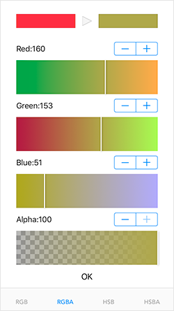
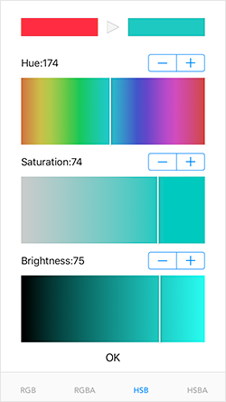
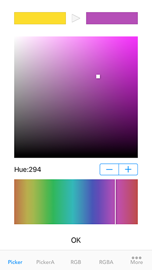

# YSColorPicker
YSColorPickerは簡単に使えるswift製カラーピッカーライブラリです。  




# Features
- RGB
- RGBA
- HSB
- HSBA
- ColorPicker
- ColorPicker(alpha)
これらのモードから任意で複数選ぶことができます。

# Installation
### CocoaPods

1. Podfileに pod `'YSColorPicker', :git => 'https://github.com/sekies/YSColorPicker.git'` と追加します。
1. pod install します。


# Usage
1. YSColorPickerをインポートします。
 ```Swift
 import YSColorPicker
 ```
2. 任意のUIViewContorollerで`YSColorsTabViewControllerDelegate` プロトコルに準拠します。
 ```Swift
 class ViewController: UIViewController,YSColorsTabViewControllerDelegate {
 ```
3. カラーピッカーを使用したいタイミングで`YSColorsTabViewController`インスタンスを生成します。生成時に初期カラーとピッカーのタイプを指定します。  
  ```Swift
  let tabvc = YSColorsTabViewController(color: btn.backgroundColor!, colorTypes: [
      .YS_COLOR_RGB,
      .YS_COLOR_RGBA,
      .YS_COLOR_HSB,
      .YS_COLOR_HSBA
  ])
  ```
4. カラーピッカーはTabViewControllerとして表示されます。viewの背景色、delegateを設定しモーダルで開きます。  
  ※delegateの設定はysColorDelegateですのでご注意ください。
  ```Swift
  tabvc.view.backgroundColor = .white
  tabvc.ysColorDelegate = self
  present(tabvc, animated: true, completion: nil)
  ```
  タイプの指定は以下の6種類から可能です。
  ```
  .YS_COLOR_PICKER,
  .YS_COLOR_PICKERA,  
  .YS_COLOR_RGB,
  .YS_COLOR_RGBA,
  .YS_COLOR_HSB,
  .YS_COLOR_HSBA
  ```
5. デリゲートメソッドを実装します。ピッカー上でカラーが変更されるたびにこのメソッドが呼び出されます。
  ```Swift
  func ysChanged(color: UIColor) {  
        btn.backgroundColor = color  
  }
  ```
